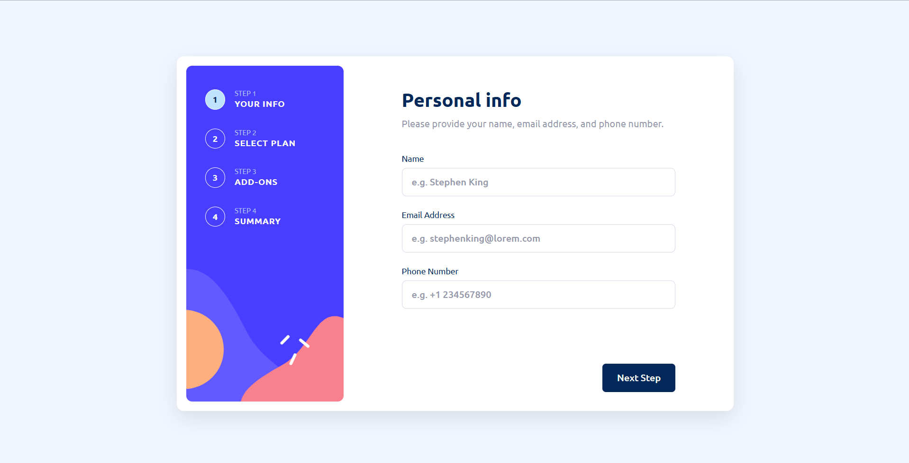

# Frontend Mentor - Multi-step form solution

This is a solution to the [Multi-step form challenge on Frontend Mentor](https://www.frontendmentor.io/challenges/multistep-form-YVAnSdqQBJ). Frontend Mentor challenges help you improve your coding skills by building realistic projects.

## Table of contents

- [Overview](#overview)
  - [The challenge](#the-challenge)
  - [Screenshot](#screenshot)
  - [Links](#links)
- [My process](#my-process)
  - [Built with](#built-with)
  - [AI tools](#ai-tools)
  - [Design tools](#design-tools)
  - [Useful resources](#useful-resources)
- [Author](#author)

## Overview

### The challenge

Users should be able to:

- Complete each step of the sequence
- Go back to a previous step to update their selections
- See a summary of their selections on the final step and confirm their order
- View the optimal layout for the interface depending on their device's screen size
- See hover and focus states for all interactive elements on the page
- Receive form validation messages if:
  - A field has been missed
  - The email address is not formatted correctly
  - A step is submitted, but no selection has been made

### Screenshot

### Links

- Solution URL: [Link](https://github.com/Mo1382/multi-step-form-main/tree/master)
- Live Site URL: [Link](https://mo1382.github.io/multi-step-form-main/)

## My process

### Built with

- Semantic HTML5 markup
- CSS
- SASS
- Flexbox
- JavaScript

## My process

### Built with

- Semantic HTML5 markup
- CSS
- SASS
- Flexbox
- JavaScript

### AI tools

- [copilot](https://github.com/features/copilot) - I used it for debugging and documenting my code

### Design tools

- [figma](https://www.figma.com/) - I used it converting images to design file
- [draw.io](https://app.diagrams.net/) - I used it for making flowcharts

### Useful resources

- [MDN Web Docs](https://developer.mozilla.org/en-US/) - When ever I forgot something about I checked this website.

- [Stack Overflow](https://stackoverflow.com/) - It's my chosen resource for solving problems.

## Author

- Frontend Mentor - [@Mo1382](https://www.frontendmentor.io/profile/Mo1382)
